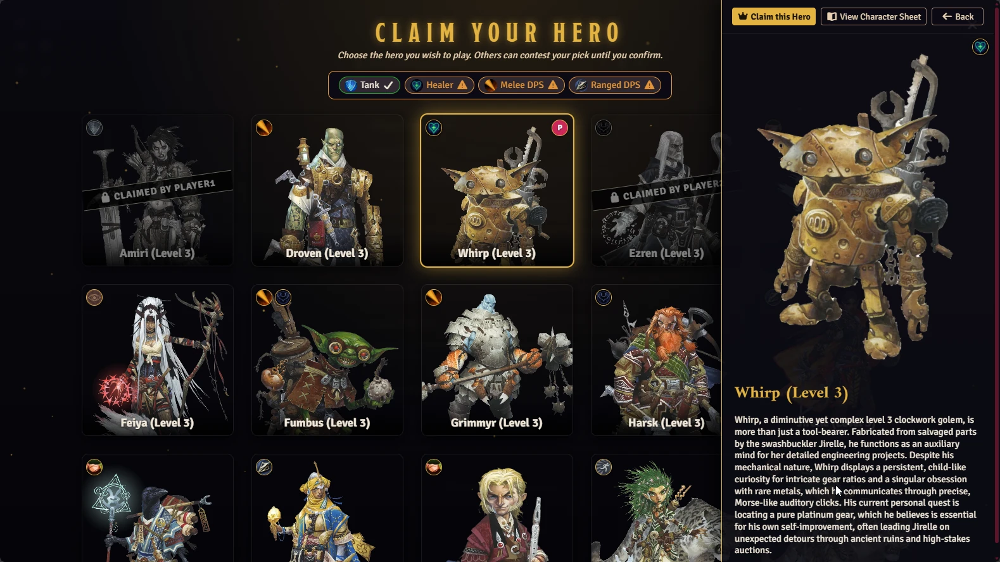
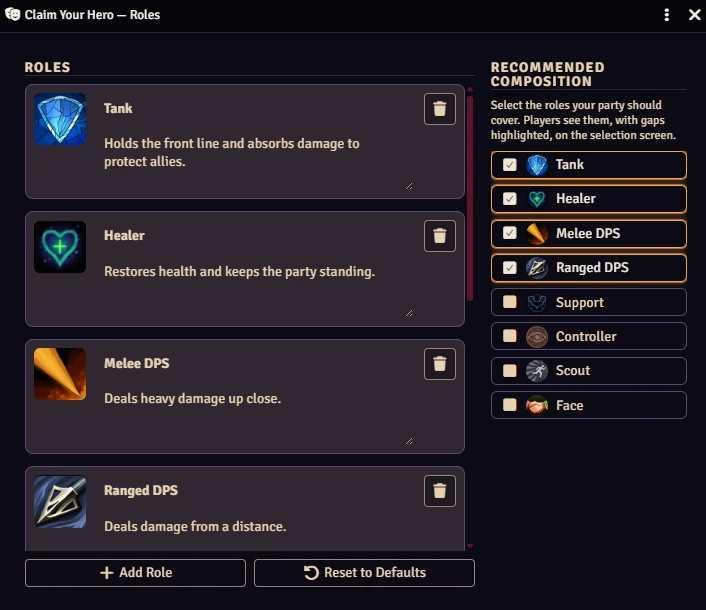
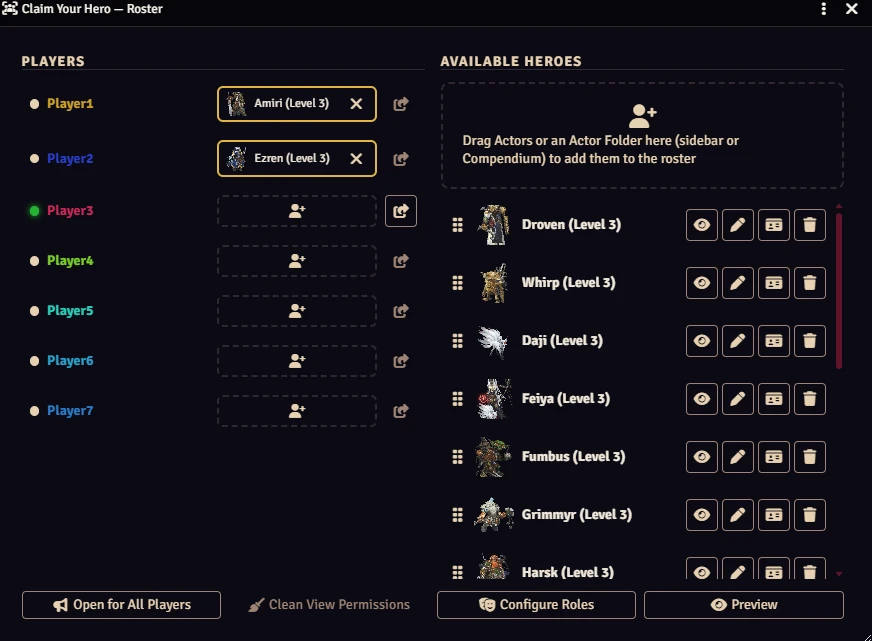
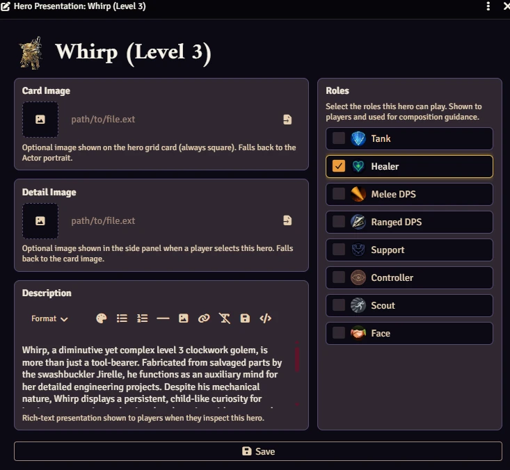

# ⚔️ Claim Your Hero

> 🇺🇸 **Read this README in English:** [English version](../README.md)

**Transforme a seleção de personagens em um momento que seus jogadores vão lembrar.**

O Claim Your Hero substitui a rotina de "o Mestre atribui um personagem a você" por uma tela de seleção cinematográfica e interativa — os jogadores percorrem uma galeria de heróis, escolhem aquele que os chama e confirmam sua escolha em tempo real.

[](https://buymeacoffee.com/mestredigital)

---

## 🎬 Veja em Ação

Veja o módulo funcionando neste vídeo de apresentação:

[](https://youtu.be/5CCyTKubE1A)

---

## ✨ O Que Ele Faz

Quando seus jogadores se conectam à sessão, eles são recebidos por uma **galeria de heróis em tela cheia**. Cada card mostra um retrato e um nome. Passar o mouse revela mais; clicar abre um painel de detalhes rico com a descrição que você escreveu — e as **funções** que aquele herói pode cumprir. Os jogadores então clicam em **Reivindicar este Herói** para torná-lo seu.

No instante em que um herói é reivindicado, o Foundry automaticamente:

- Concede ao jogador a permissão de **Proprietário** sobre aquele Ator
- Define aquele Ator como o **personagem atribuído** dele
- Bloqueia o herói para que ninguém mais possa pegá-lo

Sem ajustes manuais de permissão. Sem idas e vindas no chat. É só escolher e jogar.

---

## 🖼️ A Tela de Seleção



A galeria é **em tela cheia e sem moldura** — ela ocupa toda a janela do navegador para que nada distraia do drama de escolher um herói. Você pode até definir um **fundo de imagem ou vídeo** personalizado atrás dela (veja [Configurações](#️-configurações)).

Cada herói tem duas imagens independentes que você pode configurar:

| Espaço de imagem | Onde aparece |
|---|---|
| **Imagem do card** | A miniatura na grade de heróis (sempre quadrada) |
| **Imagem de detalhe** | A arte grande exibida no painel lateral quando um jogador seleciona o herói |

Ambos os espaços usam o retrato do Ator como alternativa se forem deixados vazios, então você só os preenche quando quiser algo diferente.

### Distintivos de função e orientação de composição

- **Distintivos de função** — heróis que você marcou com funções exibem pequenos distintivos no card e no painel de detalhes, para que os jogadores vejam de relance quem tanca, quem cura e quem causa dano.
- **Barra de composição** — quando você define uma composição de grupo recomendada, uma barra lista as funções que o grupo deve cobrir e marca cada uma como **✅ coberta** ou **⚠️ faltando** conforme os heróis são reivindicados. Escolher um herói passa a ser sobre preencher as lacunas da equipe, não apenas sobre aparência.

Veja [Funções da Equipe e Composição](#-funções-da-equipe--composição) para saber como configurar isso.

### Disputando uma escolha

Vários jogadores podem navegar ao mesmo tempo. Se dois jogadores estão de olho no mesmo herói, um pequeno indicador aparece no card — **o primeiro a confirmar leva**.

### Já tem um herói?

Se você reabrir a tela de seleção para um jogador que já reivindicou alguém (por exemplo, com **Abrir para Todos os Jogadores**), o herói atual dele é destacado como **Seu Herói**. O painel de detalhes ganha um botão **Liberar Herói** — um clique devolve o herói à reserva e libera o jogador para escolher outro imediatamente.

---

## 🎭 Funções da Equipe & Composição

Opcional, mas poderoso para grupos que se importam com um grupo equilibrado.



Abra **Configurações → Configurações de Módulos → Funções da Equipe → Configurar Funções** — ou simplesmente clique no botão **Configurar Funções** dentro do painel da Lista — para gerenciar seu catálogo de funções e a composição recomendada lado a lado.

### O catálogo de funções

- Vem pré-carregado com **oito funções prontas para usar**: Tanque, Curandeiro, DPS Corpo a Corpo, DPS à Distância, Suporte, Controlador, Batedor e Diplomata.
- Edite qualquer função **diretamente na lista** — altere o nome e a descrição no lugar, ou clique no ícone para escolher qualquer imagem com o Seletor de Arquivos (a pré-visualização atualiza ao vivo).
- **Adicionar Função** para criar a sua própria; **Restaurar Padrões** restabelece o conjunto original (com confirmação).
- Exclua as funções que você não usa — funções removidas são descartadas de forma limpa de cada marcação de herói e da recomendação, sem deixar dados obsoletos.

### Composição recomendada

Bem ao lado do catálogo, marque as funções que seu grupo *deve* cobrir. Os jogadores veem essa lista na tela de seleção, com as lacunas destacadas, para que o grupo possa se coordenar em vez de todos dobrarem no mesmo arquétipo.

### Marcando heróis

No editor de apresentação de cada herói, marque quais funções aquele herói pode desempenhar. Essas marcações alimentam os distintivos na tela de seleção e o cálculo de coberto/faltando na barra de composição.

---

## 🛠️ O Painel do Mestre

Tudo é gerenciado a partir de um único painel de **Lista** que você abre nas configurações do módulo. Ele é dividido em duas colunas:



**👥 Jogadores (esquerda)** — todos os usuários não-Mestre do seu mundo, com um ponto verde para os jogadores conectados e um espaço mostrando o personagem atual de cada um.

**🦸 Heróis Disponíveis (direita)** — todos os Atores que você preparou para a seleção.

### Adicionar heróis é simples

Arraste qualquer Ator diretamente para a zona de soltar **Heróis Disponíveis** — da barra lateral ou direto de um Compêndio. Solte uma **Pasta de Atores** inteira (incluindo suas subpastas) para adicionar todos os heróis dentro dela de uma vez. O módulo importa Atores de Compêndio para o mundo automaticamente, sem passos manuais.

### Apresentação por herói

Clique no botão ✏️ **Editar** em qualquer linha de herói para personalizar:



- **Imagem do card** — miniatura exibida na grade de seleção, com pré-visualização ao vivo
- **Imagem de detalhe** — arte maior exibida quando um jogador abre o painel de detalhes do herói, com pré-visualização ao vivo
- **Descrição** — campo de texto rico (negrito, itálico, links, o que você precisar) exibido quando um jogador inspeciona o herói
- **Funções** — marque quais funções este herói pode preencher

### 👁️ Oculte heróis seletivamente

Alterne o botão de visibilidade em qualquer herói para **ocultá-lo da galeria dos jogadores** sem removê-lo da lista. Heróis ocultos permanecem invisíveis para os jogadores até você revelá-los — perfeito para revelações no meio da campanha ou para manter personagens-surpresa fora da tela até o momento dramático certo.

### Atribuição direta

Precisa pular a tela de seleção por completo? Arraste a linha de um herói diretamente para o espaço de um jogador e confirme o pop-up. O módulo cuida da propriedade e da vinculação do personagem em um único passo.

### Liberando uma reivindicação

Mudou de ideia? Clique no botão **Desatribuir** ao lado do personagem reivindicado de qualquer jogador para liberar o herói — a propriedade é revogada e o herói volta à lista de disponíveis automaticamente. (Os jogadores também podem liberar o próprio herói pela tela de seleção — veja [Já tem um herói?](#já-tem-um-herói))

### Deixando os jogadores inspecionarem fichas

Quando **Permitir Ver Fichas de Personagem** está ativado, os jogadores ganham um botão **Ver Ficha de Personagem** em cada herói não reivindicado. O acesso é concedido **sob demanda** — apenas ao jogador que clica em Ver, e apenas para aquele herói (vários jogadores podem espiar o mesmo herói ao mesmo tempo). Ele é revogado automaticamente quando o herói é reivindicado.

O painel da Lista mantém isso organizado para você:

- Cada herói mostra um **👁️ indicador de olho** com o número de jogadores que podem vê-lo no momento; passe o mouse para ver exatamente quem.
- O botão **Limpar Permissões de Visualização** revoga toda visualização pendente em um clique.
- Sempre que houver jogadores com permissões de visualização pendentes, um botão de atalho exclusivo do Mestre (com um ponto de alerta) aparece no **cabeçalho do diretório de Atores** e leva direto a este painel.

A limpeza também é automática: concessões pendentes são corrigidas no carregamento do mundo, e desligar a opção limpa todas. O acesso revogado retorna à propriedade **Padrão** do mundo em vez de ser fixado em "Nenhum".

### Enviando a tela aos jogadores

- **Abrir para Todos os Jogadores** — envia a tela de seleção para todos os jogadores conectados de uma vez.
- **Abrir para [Jogador]** — envia para um jogador específico a partir da linha dele.
- **Pré-visualizar** — abre uma pré-visualização local somente leitura na sua própria tela para você conferir como a lista aparece antes de torná-la pública.

---

## 🔊 Sons Atmosféricos

A tela de seleção toca sutis sinais sonoros para intensificar o clima:

| Sinal | Quando |
|---|---|
| **Passar o mouse** | O cursor passa sobre um card de herói |
| **Selecionar** | O painel de detalhes abre |
| **Confirmar** | Um herói é reivindicado |

Os três sons e o volume principal são configuráveis em **Sons da Seleção** nas configurações do módulo. Você pode apontar cada sinal para qualquer arquivo de áudio na sua pasta de dados do Foundry.

---

## 🎨 Fundo da Tela de Seleção

Dê à galeria um pano de fundo em **Configurações → Configurações de Módulos → Fundo da Seleção → Configurar Fundo**:

- Suporta **imagens** estáticas (`.jpg`, `.png`, `.webp`, …) e **vídeos** em loop (`.mp4`, `.webm`); vídeos sempre tocam sem som.
- Uma **sobreposição escura** ajustável (0–100% de opacidade) fica entre o fundo e o conteúdo, mantendo os cards de herói e o texto legíveis com qualquer brilho de fundo.
- As mudanças são transmitidas a todos os clientes conectados imediatamente — a tela de seleção atualiza ao vivo, sem necessidade de recarregar.

---

## ⚙️ Configurações

O Claim Your Hero é configurado em **Configurações → Configurações de Módulos**. Quatro painéis fazem o trabalho pesado:

| Painel | O que ele abre |
|---|---|
| **Lista de Heróis → Configurar Lista** | O painel da Lista do Mestre (jogadores, heróis, atribuição) |
| **Funções da Equipe → Configurar Funções** | O catálogo de funções e a composição recomendada |
| **Sons da Seleção → Configurar Sons** | Sinais de passar o mouse / selecionar / confirmar e volume |
| **Fundo da Seleção → Configurar Fundo** | Pano de fundo de imagem ou vídeo para a galeria |

Além de dois interruptores de mundo:

| Configuração | Padrão | O que faz |
|---|---|---|
| **Abrir Seleção Automaticamente** | Ligado | Mostra a tela aos jogadores que se conectam sem um personagem atribuído (requer pelo menos um herói na lista) |
| **Permitir Ver Fichas de Personagem** | Ligado | Permite que os jogadores abram a ficha completa de um herói pela tela de seleção. O acesso de observador é concedido sob demanda apenas ao jogador que clica em Ver, e é removido novamente assim que ele reivindica um herói, quando a opção é desligada ou no próximo carregamento do mundo. |

---

## ⚡ Tempo Real & Sem Conflitos

O Claim Your Hero usa a camada de socket nativa e o sistema de consultas do Foundry, então cada escolha fica visível a todos os clientes conectados no instante em que acontece. O cliente do Mestre age como autoridade: quando um jogador confirma, a reivindicação é validada no lado do servidor antes de qualquer mudança de permissão — eliminando condições de corrida mesmo quando dois jogadores clicam simultaneamente.

---

## 🚀 Primeiros Passos

1. Instale o módulo e ative-o no seu mundo.
2. Abra **Configurações → Configurações de Módulos → Lista de Heróis → Configurar Lista**.
3. Arraste seus Atores (da barra lateral, de uma pasta ou de um Compêndio) para a zona **Heróis Disponíveis**.
4. Opcionalmente, personalize as imagens, a descrição e as funções de cada herói com o botão ✏️.
5. (Opcional) Configure as **Funções da Equipe** e uma **composição recomendada** para que os jogadores possam equilibrar o grupo.
6. Use **Pré-visualizar** para ver como a galeria fica antes dos seus jogadores.
7. Quando seus jogadores se conectarem, a tela de seleção abre automaticamente — ou envie-a manualmente com **Abrir para Todos os Jogadores**.
8. Assista a eles discutirem sobre quem fica com o paladino.

---

## 🚀 Instalação

Instale pelo navegador de Módulos do Foundry VTT ou use este link de manifesto:

```
https://raw.githubusercontent.com/brunocalado/claim-your-hero/main/module.json
```

---

## 🐛 Relatos de Bugs & Pedidos de Funcionalidades

https://github.com/brunocalado/claim-your-hero/issues

---

## 📜 Créditos & Licença

Distribuído sob a [LICENSE](../LICENSE).

**Efeitos sonoros:**

- Som de passar o mouse — [Pixabay](https://pixabay.com/sound-effects/film-special-effects-minimalist-button-hover-sound-effect-399749/)
- Som de seleção — [Pixabay](https://pixabay.com/sound-effects/technology-bell1-445873/)
- Som de confirmação — [Pixabay](https://pixabay.com/sound-effects/musical-winbrass-39632/)
